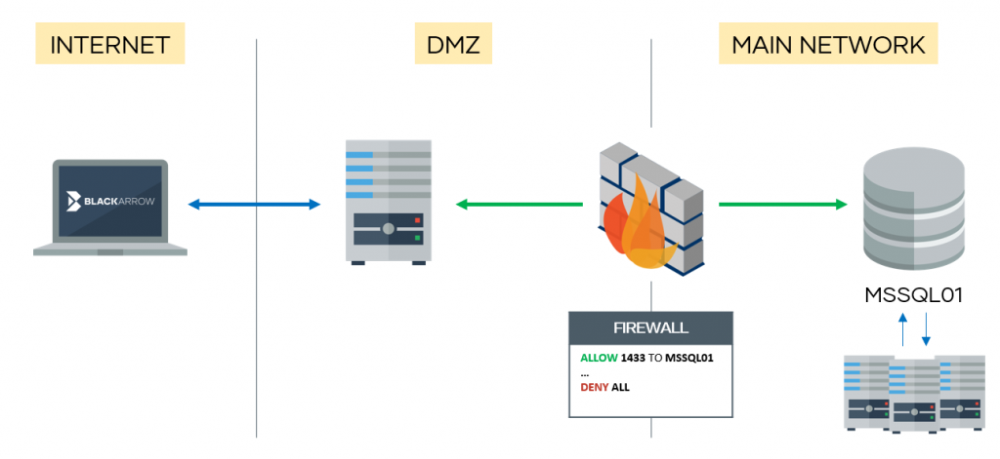

# mssqlproxy
 []() []()


**mssqlproxy** is a toolkit aimed to perform lateral movement in restricted environments through a compromised Microsoft SQL Server via socket reuse. The client requires [impacket](https://github.com/SecureAuthCorp/impacket) and **sysadmin** privileges on the SQL server.

<p align="center">
  
</p>


Please read [this article](https://www.blackarrow.net/mssqlproxy-pivoting-clr/) carefully before continuing.

It consists of three parts:
*  **CLR assembly**: Compile assembly.cs
*  **Core DLL**: Compile reciclador.sln
*  **Client**: mssqlclient.py (based on Impacket's example)

You can compile the libraries or download them from [releases](https://github.com/blackarrowsec/mssqlproxy/releases) (x64).


Compilation
------------

To generate the core DLL, just import the project to Visual Studio (reciclador.sln) and compile it.

To generate the CLR assembly, first you need to find the C# compiler:
```powershell
Get-ChildItem -Recurse "C:\Windows\Microsoft.NET\" -Filter "csc.exe" | Sort-Object fullname -Descending | Select-Object fullname -First 1 -ExpandProperty fullname
```

Then,
```powershell
C:\Windows\Microsoft.NET\Framework64\v4.0.30319\csc.exe /target:library .\assembly.cs
```


Usage
------------
Once the two libraries are compiled, upload the core DLL (reciclador) to the target server.

Authentication options are the same as the ones in [the original mssqlclient](https://github.com/SecureAuthCorp/impacket/blob/master/examples/mssqlclient.py). **mssqlproxy** options:

```
proxy mode:
  -reciclador path      Remote path where DLL is stored in server
  -install              Installs CLR assembly
  -uninstall            Uninstalls CLR assembly
  -check                Checks if CLR is ready
  -start                Starts proxy
  -local-port port      Local port to listen on
  -clr local_path       Local CLR path
  -no-check-src-port    Use this option when connection is not direct (e.g. proxy)
```

We have also implemented two commands (within the SQL shell) for downloading and uploading files. Relating to the proxy stuff, we have four commands:

* **install**: Creates the CLR assembly and links it to a stored procedure. You need to provide the `-clr` param to read the generated CLR from a local DLL file.
* **uninstall**: Removes what **install** created.
* **check**: Checks if everything is ready to start the proxy. Requires to provide the server DLL location (`-reciclador`), which can be uploaded using the **upload** command.
* **start**: Starts the proxy. If `-local-port` is not specified, it will listen on port 1337/tcp.

Once the proxy is started, you can plug in your proxychains ;)

[](https://asciinema.org/a/298949)

**Note #1:** if using a non-direct connection (e.g. proxies in between), the `-no-check-src-port` flag is needed, so the server only checks the source address.

**Note #2:** at the moment, only IPv4 targets are supported (nor DNS neither IPv6 addresses).

**Note #3:** use carefully! by now the MSSQL service will crash if you try to establish multiple concurrent connections

**Important:** It's important to stop the mssqlproxy by pressing Ctrl+C on the client. If not, the server may crash and you will have to restart the MSSQL service manually.


Authors
---------------
Pablo Martinez ([@xassiz](https://twitter.com/xassiz)), Juan Manuel Fernandez ([@TheXC3LL](https://twitter.com/TheXC3LL)) [ [www.blackarrow.net](http://blackarrow.net/) - [www.tarlogic.com](https://www.tarlogic.com/en/) ]


References
---------------

* https://www.blackhat.com/presentations/bh-asia-03/bh-asia-03-chong.pdf
* https://blog.netspi.com/attacking-sql-server-clr-assemblies/
* https://www.codeproject.com/Articles/27298/Dynamic-Invoke-C-DLL-function-in-C
* https://x-c3ll.github.io/posts/Pivoting-MySQL-Proxy/
* https://docs.microsoft.com/en-us/sql/ado/reference/ado-api/stream-object-ado
* https://docs.microsoft.com/es-es/sql/t-sql/functions/openrowset-transact-sql

License
-------

All the code included in this project is licensed under the terms of the MIT license. The mssqlclient.py is based on [Impacket](https://github.com/SecureAuthCorp/impacket/blob/master/examples/mssqlclient.py).

#

[](https://www.blackarrow.net) [](https://twitter.com/BlackArrowSec) [](https://www.linkedin.com/company/blackarrowsec/)
